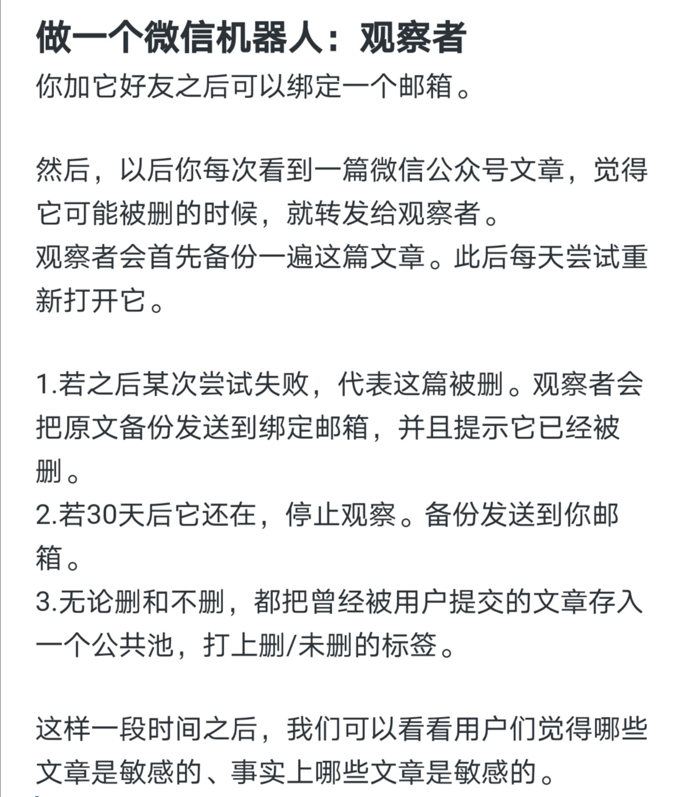

# Observer
<!-- ALL-CONTRIBUTORS-BADGE:START - Do not remove or modify this section -->

<!-- ALL-CONTRIBUTORS-BADGE:END -->
A simple tool for checking accessibility of specific articles

构想：

受启发于[端点星计划](https://github.com/Terminus2049/Terminus2049.github.io)，想要在微信上实现一个自动备份机器人。用户将文章链接转发给它，它能自动备份文章，并定期观察该文是否被删。事后邮件通知用户。

开发计划见：[plan](dev_docs/plan.md)

## Contributors ✨

Thanks goes to these wonderful people ([emoji key](https://allcontributors.org/docs/en/emoji-key)):

<!-- ALL-CONTRIBUTORS-LIST:START - Do not remove or modify this section -->
<!-- prettier-ignore-start -->
<!-- markdownlint-disable -->
<table>
  <tr>
    <td align="center"><a href="http://www.twisted-meadows.com"> <b>游荡</b></a> <a href="https://github.com/MamaShip/Observer/commits?author=MamaShip" title="Code">💻</a></td>
  </tr>
</table>

<!-- markdownlint-enable -->
<!-- prettier-ignore-end -->
<!-- ALL-CONTRIBUTORS-LIST:END -->

This project follows the [all-contributors](https://github.com/all-contributors/all-contributors) specification. Contributions of any kind welcome!