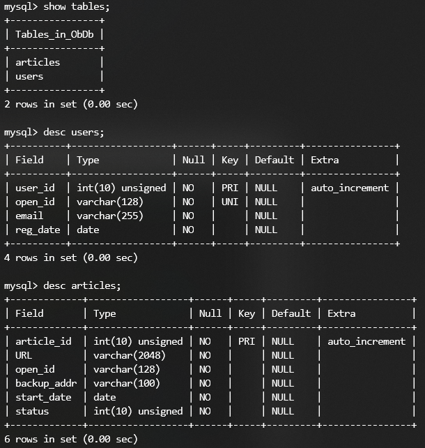

## DB_Operator功能模块

本模块实现了对 MySQL 数据库的操作。

依赖的第三方库：[mysql-connector-python](https://dev.mysql.com/doc/connector-python/en/connector-python-introduction.html)

db_operator.py 提供了一个类 **DbOperator**，用于操作 MySQL。具体接口见文档： [pydoc_output.txt](pydoc_output.txt)

数据库内实际管理了2个表(users, articles)，结构如下：

pytest 无法进行涉及 MySQL 调用的测试。因此自己写了一点测试放在 self_test_db_operator.py

