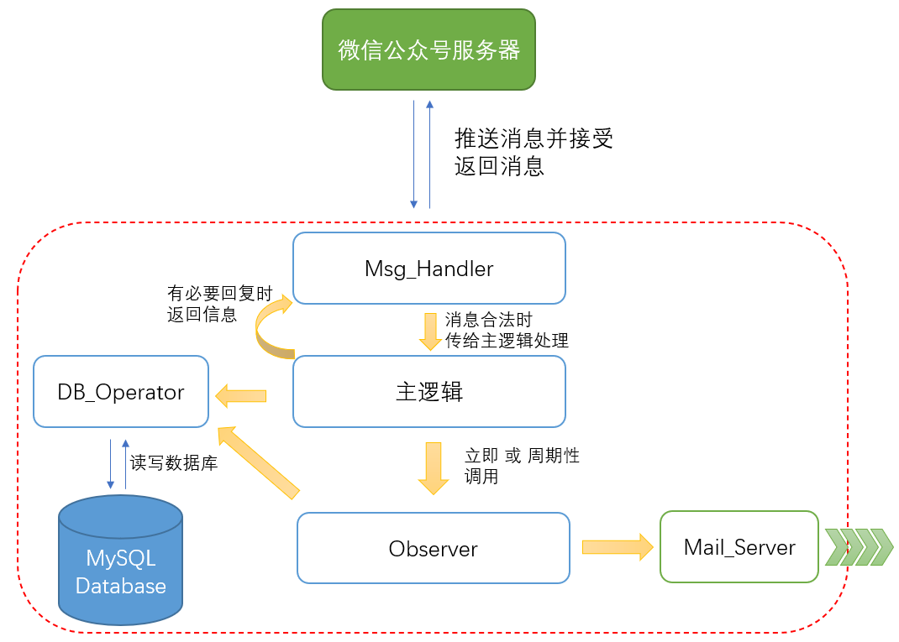

计划利用微信公众号的API接口，响应微信用户的消息来实现功能。基本框架如上图所示。

程序主体用 Python 实现。涉及 MySQL 数据库操作、Mail 发送。

****
## 主要组件功能设计
### Msg_Handler

使用微信提供的公众号API处理微信消息。具体用法待研究。

可参考的SDK库：
* Python SDK：https://github.com/wechatpy/wechatpy
* Go SDK：https://github.com/chanxuehong/wechat

### 主逻辑

涉及以下功能：
* 用户初次绑定邮箱
* 用户修改绑定的邮箱
* 新文章加入观察
* 立即/周期性触发观察者的观察动作

同时主逻辑还要运行一个 Timer ，这个 Timer 定时触发观察动作。

### Observer

功能：
调用 DB Operator 读取观察目标，执行一次观察：
* 若为初次观察，做一次备份
* 若链接有效，且存在备份，结束
* 若链接失效，向数据库写入失效标签，发送备份给用户，从观察列表中剔除。

### Mail_Server

发送备份的邮件给特定邮箱

****

## 接口定义
我们常驻后台运行的其实是 **Msg_Handler**

它调用主逻辑，因此主逻辑给它提供接口。
### 主逻辑接口
* Add_User
* Update_User
* Remove_User
* Add_OB_Article
### DB_Operator接口
* Add_User
* Find_User
* Update_User
* Remove_User
* Add_Article
* Remove_Article
* Update_Article (tag)
### Observer接口
* Ob_This_One
* Ob_All
### Mail_Server接口
* Send

****

## 工作量及任务规划
- [x] 搞一个微信公众号 1h 
- [ ] 搞个能用的 Linux 服务器  1h
- [ ] 微信消息接口调试  12h
- [ ] 主逻辑   3h
- [ ] mail server   3h
- [ ] MySQL 部署及 DB_Operator  4h
- [ ] Observer   3h
- [ ] 联调联测    2h

## More features
* 用于查看当前状态/统计信息的管理页面（PHP技能需要
* 多个用户提交相同页面时的去重